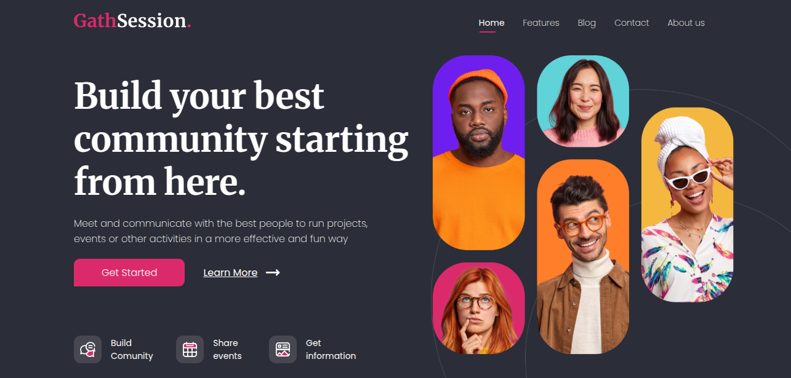

# header-hero-gathsession


This project is a header, hero for  the website above. It usses CSS, HTML to recreate the design and features, also it uses Sass and vite to compile.

# features

1. Use of variables for colors and fonts.
2. Use of flex to position elements.

# Contributions

If you would like to improve something on the code. It is welcome to make it better!

1. Fork the repository.

2. Create a new branch: 
    ```sh
    git checkout -b feature-branch-name
    ```
3. Make the changes and commit: 
    ```sh
    git commit -m 'new feature added'
    ```
4. Push the changes to the branch: 
    ```sh
    git push origin feature-branch-name
    ```
5. Open a pull request detailing your changes!

***
# header-hero-gathsession


Este projecto se enfoca en el header y hero del sitio en la imagen. Se utilizó CSS, HTML para recrear el diseño, caracteristicas y detalles. Igualmente se utilizó Sass y vite.

# Caracteristicas

1. Declaración de variables para colores y fuentes.
2. Uso de flex para posicionar elementos.

# Contribuciones

Si tienes una idea para mejorar el código me gustaría verlo!!

1. Haz un fork del repositorio.

2. Crea una nueva rama: 
    ```sh
    git checkout -b feature-branch-name
    ```
3. Haz los cambios y  commit: 
    ```sh
    git commit -m 'new feature added'
    ```
4. Pushea los cambios a la rama: 
    ```sh
    git push origin feature-branch-name
    ```
5. Abre un pull request informando los cambios!.